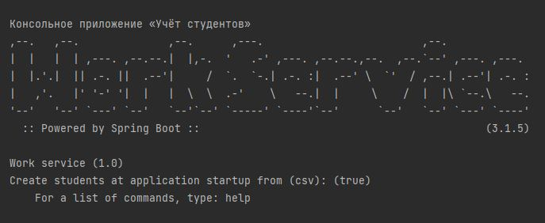

[Постановка задачи](Task.md)

#### Небольшое консольное приложение «Учёт студентов»
Реализовано небольшое консольное приложение «Учёт студентов».  
Интерфейс консольного приложения выполнен с помощью стартера Spring Shell.  
Сущность «Студент» представляет из себя   
   **Имя (firstName), фамилию (lastName) и возраст (age).**  
Идентификатор (id) - генерируется и кладётся в мапу в качестве ключа.

[Список команд приложения:](commands.md)

#### Описание программы
Приложение реагирует на события создания и удаления студента.  
При создании приложение выводит в консоль информацию о созданном клиенте,  
а при удалении — идентификатор удалённого клиента.  
Слушатели реализованы через EventListener.  
* WorkService: Основная логика
* AppProperties: Геттеры для получения свойств из application.yaml
* пакет event: Реализованы слушатели
* GeneratorStudentImpl: Генерация студентов при запуске приложения
* LoadStudentsFromCSVImpl или LoadStudentsFromGenImpl: Формирование списка судентов для заполнения мапы
* ParseLineImpl: Парсит строку
* application.yaml: Комментарии внутри файла

[Примечания](notes.md)

[Пример файла для загрузки при старте](csv.md)  

[Запуск приложения используя Docker](docker.md)

**Полезные ссылки:**  
[Online Spring Boot Banner Generator (with FIGlet Fonts)](https://devops.datenkollektiv.de/banner.txt/index.html)  
[Spring Boot Application Events Explained](https://reflectoring.io/spring-boot-application-events-explained/)

